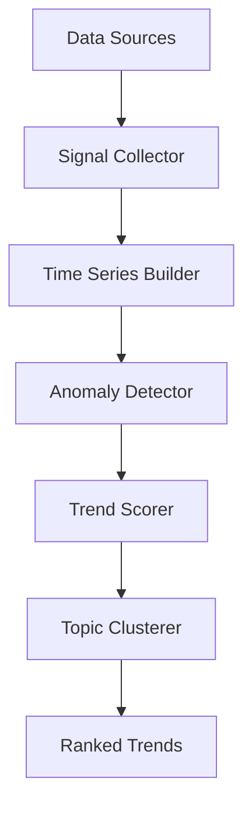

# 🔥 TrendSeer

> Detect emerging tech trends before they go viral

[](https://github.com/MukundaKatta/TrendSeer/actions)
[](LICENSE)
[]()

## What is TrendSeer?
TrendSeer detects emerging technology trends by analyzing signals from multiple sources. It uses statistical anomaly detection on time-series data — not just keyword counting — to identify trends early.

## ✨ Features
- ✅ Multi-source signal aggregation (RSS, GitHub, HN)
- ✅ Time-series anomaly detection (z-score, rolling averages)
- ✅ Trend scoring and ranking
- ✅ Keyword extraction and topic clustering
- ✅ JSON and CSV export
- 🔜 Real-time streaming mode
- 🔜 Slack/Discord notifications

## 🚀 Quick Start
```bash
pip install trendseer
```
```python
from trendseer import TrendDetector

detector = TrendDetector()
detector.add_source("hackernews", limit=100)
detector.add_source("github_trending", language="python")
trends = detector.detect()
for trend in trends.top(10):
    print(f"{trend.topic}: score={trend.score:.2f}, velocity={trend.velocity:.2f}")
```

## 🏗️ Architecture


## 📖 Inspired By
Inspired by [MiroFish](https://github.com/666ghj/MiroFish) swarm intelligence predictions, but focused specifically on tech/AI trend detection with statistical methods.

---
**Built by [Officethree Technologies](https://github.com/MukundaKatta)** | Made with ❤️ and AI
